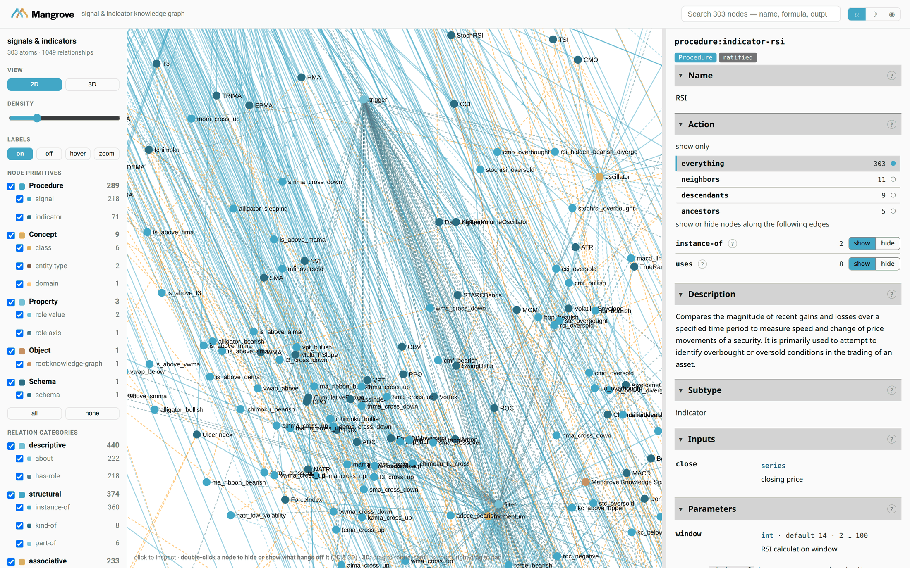
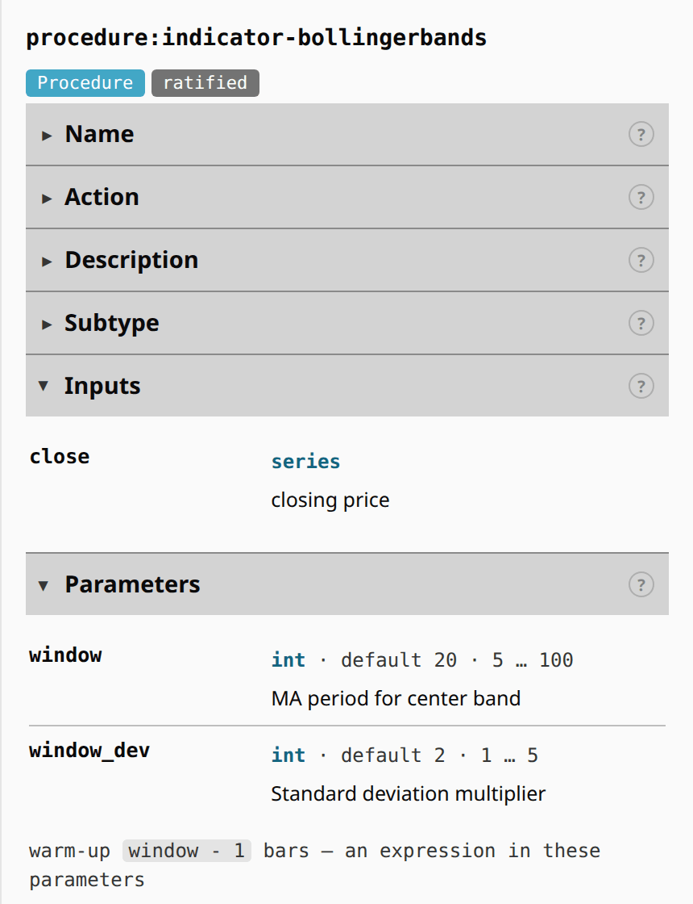
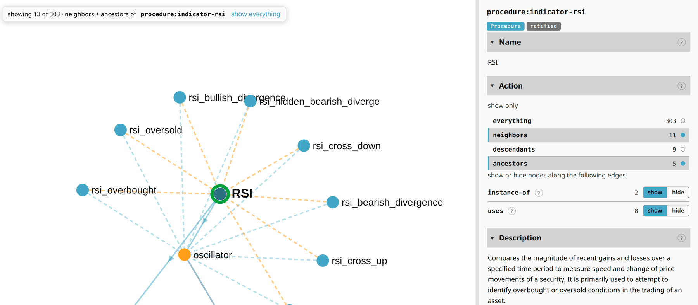
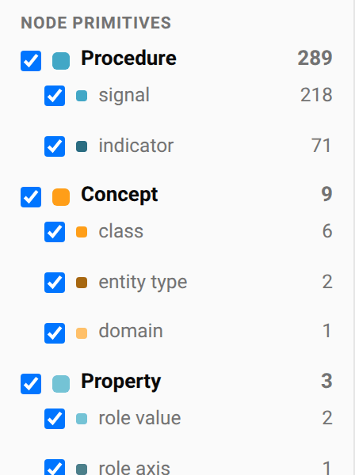
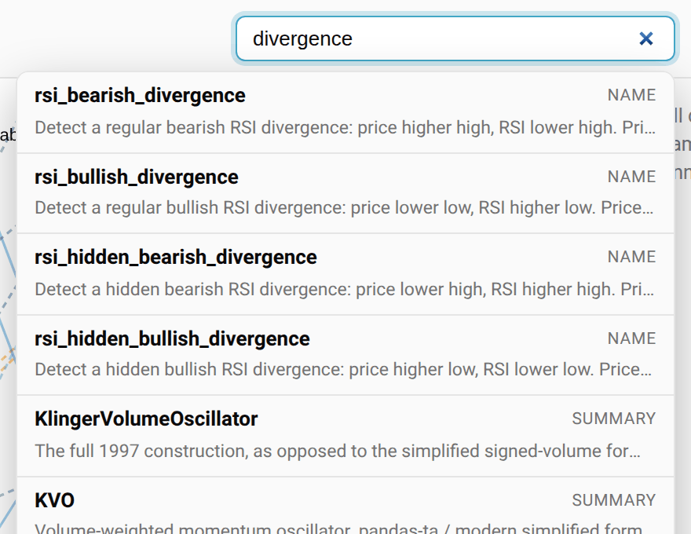
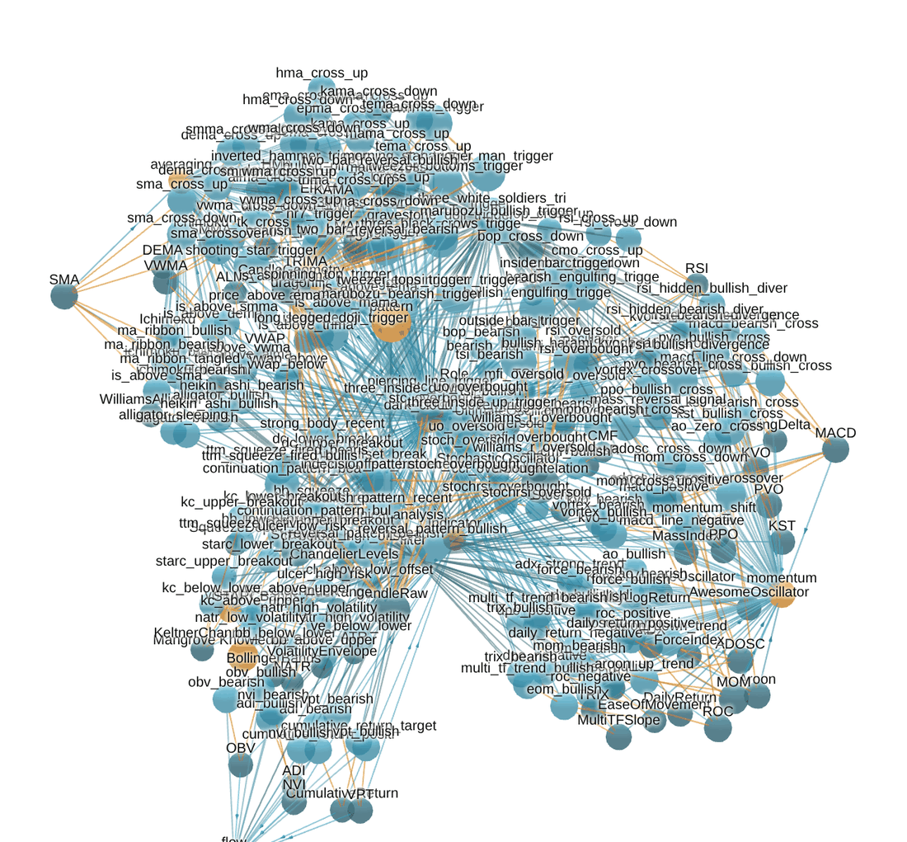

<h1 align="center">MangroveKnowledgeBase</h1>

<p align="center"><strong>A trading-signal library that ships a knowledge graph of itself.</strong></p>

<p align="center">
  <a href="https://pypi.org/project/mangrove-kb/"></a>
  
  
  
  
  
</p>

<p align="center">
  <a href="https://discord.gg/Yycbw6P93B"></a>
  <a href="https://pepy.tech/projects/mangrove-kb"></a>
</p>

**249 trading signal functions** (119 TRIGGER, 130 FILTER) and **80 technical indicator classes**,
every one with a machine-readable docstring — formula, inputs, parameters with ranges and defaults,
typed outputs with units, and warmup.

And a **knowledge graph built from that source** — 303 nodes and 1049 edges saying what each
computation is, what it measures, what it reads, and what part it plays. It is generated from the
code, so it is exact: not extracted from prose, not approximate, no ranking model in the way.

The point is the second thing. A library of 249 functions is only useful if you can find the right
one, and `grep` cannot answer *"which indicators produce a bounded oscillator"*, *"what reads RSI's
third output"*, or *"is there already a signal for this"*. The graph can, and the answers are facts
about the code as it is.



*The bundled viewer (`python -m mangrove_kb.viz`): click any node to read what it computes and walk
its edges. [Interface guide](docs/viewer-guide.md) · [what each part does](#the-viewer).*

## Contents

- [Install](#install)
- [Quick start](#quick-start)
  - [1 · Ask the graph before you read the source](#1--ask-the-graph-before-you-read-the-source)
  - [2 · Work out what a change breaks](#2--work-out-what-a-change-breaks)
  - [3 · Ask about the values, not the nodes](#3--ask-about-the-values-not-the-nodes)
  - [4 · Explain an answer](#4--explain-an-answer)
  - [5 · Run what you found](#5--run-what-you-found)
  - [6 · View it in a browser](#6--view-it-in-a-browser)
- [Skill & graph tools](#skill--graph-tools)
  - [The tools](#the-tools)
- [The model in 30 seconds](#the-model-in-30-seconds)
- [The viewer](#the-viewer)
  - [The inspector — what a node actually carries](#the-inspector--what-a-node-actually-carries)
  - [The Action panel — trim the graph to the question](#the-action-panel--trim-the-graph-to-the-question)
  - [The rail — two-level filters](#the-rail--two-level-filters)
  - [Search — ranked, and it tells you why](#search--ranked-and-it-tells-you-why)
  - [2D and 3D](#2d-and-3d)
- [What is in the graph, and what is not](#what-is-in-the-graph-and-what-is-not)
- [Repository structure](#repository-structure)
- [Development](#development)
- [License](#license)
- [Contributing](#contributing)
- [Links](#links)

---
## Install

```bash
pip install mangrove-kb
```

Python 3.10+; `numpy` and `pandas` are the only runtime dependencies. The graph, the agent skill and
the viewer all ship **inside the wheel** — there is nothing else to fetch.

---

## Quick start

### 1 · Ask the graph before you read the source

```python
from mangrove_kb.graph import KnowledgeGraph
kg = KnowledgeGraph.load()

kg.stats()                                   # counts + every value a filter will accept
kg.find("divergence")                        # search name, abbreviation, summary, authored detail
kg.find(kind="momentum", role="trigger")     # by what it measures AND the part it plays
kg.get("rsi_oversold")                       # formula, params, typed outputs, warmup
```

`stats()` first, always. It returns the **complete vocabulary** every other call accepts — relations,
classes, roles, statuses, input columns, output units — so you never have to guess a name. Filters
that take a vocabulary raise and list the legal values rather than returning an empty result you
would read as *"there are none"*.

### 2 · Work out what a change breaks

```python
kg.neighbors("procedure:indicator-rsi", relation="uses", direction="in", limit=None)
# every signal that reads RSI -- and each edge says WHICH output it reads
```

### 3 · Ask about the values, not the nodes

```python
kg.outputs(bounded=True, kind="oscillator", limit=None)   # 48 outputs, each with units and range
kg.outputs("histogram")                                   # who produces one -- MACD, and only MACD
```

`outputs()` indexes **values rather than nodes**: one row per output, each naming its producer. It
answers *"what can I plot on one panel"* — which `get()` can only answer one node at a time, and
which `resolve()` cannot answer at all, since `histogram` is nobody's node name.

### 4 · Explain an answer

```python
kg.all_paths("adosc_bearish", "momentum")
# adosc_bearish --about--> momentum                                  the claim
# adosc_bearish --uses--> indicator-adosc --instance-of--> momentum  the reason
```

### 5 · Run what you found

```python
from mangrove_kb import RuleRegistry, sample_ohlcv
from mangrove_kb.signals import momentum          # import the class module to register it

node = kg.get("procedure:signal-adosc-cross-down")
RuleRegistry.evaluate({"name": node["name"], "params": {"fast": 3, "slow": 10}}, sample_ohlcv())
```

A node's `name` **is** the registered signal name. That join is what makes this a map of a runnable
library rather than an encyclopedia.

### 6 · View it in a browser

```bash
python -m mangrove_kb.viz > graph.html
```

One self-contained file — no CDN, no build step, no network.

---

## Skill & graph tools

Two documents ship **inside the wheel**, so an agent that installs the package has them without
fetching anything:

| | what it is |
|---|---|
| [`SKILL.md`](skills/knowledge-graph/SKILL.md) | the reference for **which call** — the two axes, the rules of use, and a question→call table |
| [`GUIDE.md`](skills/knowledge-graph/GUIDE.md) | the reference for **what a whole job looks like** — thirteen tasks end to end, with real output and the trap in each |

Both are executable documentation: every example in them is re-run by the test suite against the
committed graph, so an example that drifts fails the build rather than misleading a reader.

### The tools

`mangrove_kb.graph.KnowledgeGraph` is the whole query surface — eight calls:

| question | call |
|---|---|
| what is in here at all? | `stats()` — **always first**; returns every value the other calls accept as a filter |
| what shapes can I even ask for? | `schema()` — the 12 `(subject, relation, object)` triples that actually occur |
| the user gave me a name, not an id | `resolve("rsi_oversold")`, or `get()`, which resolves too |
| is there already a signal for X? | `find("keyword")` — ranked by *where* it matched |
| everything of a class, or in a role, or both | `find(kind=…, role=…)` |
| what needs volume? what is retired? | `find(requires=…)`, `find(status=…)` |
| what does this compute — formula, params, outputs? | `get(id)` |
| which values are bounded / in these units? | `outputs(bounded=True, units=…)` |
| what produces an output called X? | `outputs("X")` |
| what reads this indicator? what does this read? | `neighbors(id, relation="uses", direction="in"\|"out")` |
| the neighbourhood around something | `subgraph(id, radius=1)` |
| how are these two related? | `path(a, b)` — one shortest route |
| every way they connect, and why | `all_paths(a, b)` — all routes, shortest first |
| now actually run what I found | `RuleRegistry.evaluate({"name": node["name"], …}, df)` |

**Every bounded return states its own truncation.** A `Result` carries `total`, `truncated` and a
`note` — a short list is never mistakable for a complete one, and `limit=None` gets everything.
Filters that take a vocabulary raise and name the legal values rather than returning an empty result
you would read as *"there are none"*.

---

## The model in 30 seconds

Every computation is classified on **two independent axes**, and they answer different questions.

| axis | relation | question | inherited? |
|---|---|---|---|
| **class** | `instance-of` (indicators) · `about` (signals) | what character is this concerned with? | over `kind-of`, yes |
| **role** | `has-role` | what part does it play in a strategy? | **never** |

The six classes — `averaging`, `flow`, `momentum`, `oscillator`, `pattern`, `volatility` — are
divisions of **technical analysis** by what a computation measures. They are `kind-of` technical
analysis, **not** `kind-of` Indicator, because they span both layers.

**An indicator *measures* its class; a signal is *about* its class.** Different claims, so different
relations:

```
ADOSC          --instance-of--> momentum      it measures rate of change
adosc_bearish  --about-------->  momentum      it is concerned with it...
adosc_bearish  --uses--------->  ADOSC         ...because of what it reads
```

Momentum is defined as measuring rate of change. A signal emits a boolean and measures nothing, so
it is not an instance — and keeping the two edges distinct is what lets the graph *explain* a
classification instead of merely asserting it.

**A role is not a type.** `filter` is not a kind of signal; it is a part some signals play, and the
same computation could play another part in another strategy. So role is never inherited and never
appears as a class. (Grounded in Steimann, *DKE* 2000, and Guarino & Welty's OntoClean, *CACM* 2002.)

Seven relations in total: `instance-of`, `kind-of`, `part-of`, `about`, `has-role`, `uses`,
`supersedes`. `kg.schema()` lists the 12 `(subject, relation, object)` shapes that actually occur, so
you can plan a traversal against what exists rather than discovering emptiness one query at a time.

---

## The viewer

`python -m mangrove_kb.viz > graph.html` writes one self-contained page: the whole graph in 2D and
3D, filterable, searchable, with every node's authored detail one click away. There is a
**[plain-language interface guide](docs/viewer-guide.md)** if you would rather read than poke.

### The inspector — what a node actually carries



Click any node or edge to pin its detail. Every field the library authored is here: description,
`formula`, `warmup_bars`, `reference`, `usage_example`, and **inputs, parameters and outputs as
tables** — each with its type, default, units and range, rather than a wall of JSON.

Sections **fold**, and the choice sticks: fold `Edges` once and it stays folded on the next node.
Each heading carries a **?** explaining what it holds, as does each edge type — `about` and
`instance-of` are different claims, and the panel says so.

Ranges are read carefully. `≥ 0` is floored, `unbounded` is a stated infinity, and `not authored` is
a gap in the notes — three different facts that `JSON.stringify` used to render identically.

**Traps worth knowing.** `warmup_bars` is an *expression* in the node's own parameters
(`window * 3 - 1`), not a number. And units are heterogeneous by design: a percentage, a price and
an index number are different things and are labelled differently.

<br clear="right">

### The Action panel — trim the graph to the question

<p align="center">
  
</p>

303 nodes at once is a picture, not an answer. **show only** keeps `neighbors`, `descendants`,
`ancestors` — or any combination of them — around the selected node, with the resulting node count
on every choice *before* you click. **show or hide** does the same one edge type at a time.

The two compose: an edge type set to hide is dropped from the lineage walk as well, so the counts
above change to match. A bar over the map says how much is in view and how to get back; `Esc` clears
it, and clearing returns the view you had rather than refitting the whole graph.

### The rail — two-level filters



Nodes group by **ontology primitive**, edges by **relation category**, and each splits into the
derived kind beneath it — so `signal` and `indicator` are separable inside `Procedure`, and `about`
is separable from `has-role` inside `descriptive`.

Sub-kinds are **shades of their parent's hue**, never new colours: all 289 of those dots are
procedures, and the darker teal is the 71 indicators among them.

Parent and child are **AND-ed**. Unticking `Procedure` hides every procedure whatever the children
say, and the children grey out to show why — so the canvas can never empty for a reason that is not
visible in the rail.

**Density** spreads or tightens the layout. **Labels** switches between always / never / on hover /
on zoom — worth reaching for at 303 nodes.

<br clear="right">

### Search — ranked, and it tells you why



Search reads **every authored field**, not just names — formula, interpretation, applications, and
the names and descriptions of inputs, params and outputs.

Results rank by *where* the query hit, and the badge says which: `NAME` first, then `ABBREV`,
`SUMMARY`, `DETAIL`. So the thing actually called "divergence" comes before the things that merely
mention it, and the long tail costs you nothing.

This is the **same ranking `kg.find()` uses** — `SEARCH_TIERS` is exported from Python into the page
rather than reimplemented in JS, and a test asserts the two agree on real queries.

<br clear="right">

### 2D and 3D

<p align="center">
  
</p>

The **3D** view is the same graph, same filters, same inspector — drag to rotate, scroll to zoom,
right-drag to pan. **Double-click any node in either view to hide or show what hangs off it**, which
is how you make a hub with 218 signals attached readable. A green ring marks the selected node; a
yellow ring marks a deprecated one. Nothing else is ringed — 301 of 303 nodes are `ratified`, so
marking that would be decoration rather than information.

---

## What is in the graph, and what is not

Of **249 registered signals**, **218 are modelled** in the graph, along with 71 of the 80 indicator
classes. The gap is deliberate:

- **Signals with no indicator beneath them** — a signal reading raw price with no measurement in
  between has no class to derive, and would sit in the graph as an unclassifiable node.
- **Stateful policy rules** — SuperTrend, PSAR, ChandelierExit, ATRTrailingStop, VolatilityStop.
  Their outputs are *verdicts*, not measurements: they carry a position forward and emit a direction.
  An indicator measures; these decide. They are excluded rather than mislabelled.
- **Private signal families** — on-chain and social signals ship in the package but are out of scope
  for the public ontology.

The graph is regenerated from a clean tree on every build, and a test rebuilds it into an empty path
and diffs against the committed file — so it cannot drift from the code it describes.

**Renames are never breaking.** A signal's registered name is the contract; a superseded duplicate
keeps working and carries a `supersedes` edge to its canonical replacement plus a deprecation
warning.

---

## Repository structure

```
MangroveKnowledgeBase/
├── mangrove_kb/                  ← the pip package
│   ├── graph.py                  ← the query library (stats · find · get · outputs ·
│   │                                neighbors · subgraph · path · all_paths)
│   ├── registry.py               ← RuleRegistry: evaluate a signal by name
│   ├── docstring_parser.py       ← docstring → structured metadata
│   ├── signals/                  ← 249 signal functions
│   ├── indicators/               ← 80 indicator classes
│   ├── viz/                      ← the self-contained graph viewer
│   ├── data/                     ← the graph, bundled at build time
│   └── skills/knowledge-graph/   ← SKILL.md + GUIDE.md, bundled at build time
├── ontology/
│   ├── build_signal_indicator_ontology.py   ← the ONLY thing that writes the graph
│   └── signal-indicator-ontology.json       ← the ontology of record
├── skills/knowledge-graph/       ← the agent skill and its guide (source of truth)
├── knowledge-base/               ← 11 trading-education documents
├── kb_server/                    ← REST + MCP server over the library
├── notebooks/                    ← signal explorer + validation
├── data/                         ← 7 sample OHLCV datasets
└── tests/                        ← the suite
```

The graph is **derived**. Authored values live in docstrings; everything else is read from the code.
Never edit `signal-indicator-ontology.json` by hand — change the docstring or the builder and rebuild:

```bash
python ontology/build_signal_indicator_ontology.py
```

---

## Development

```bash
pip install -e ".[dev]"
pytest tests/ -q
flake8 mangrove_kb/ --max-line-length=120
```

---

## License

Free for noncommercial use under the [PolyForm Noncommercial License 1.0.0](LICENSE) — personal
study, hobby projects, research, teaching, and use by charitable, educational, public-research and
government organizations.

**Commercial use requires a paid license.** Using mangrove-kb in a product or service you sell, or
internally in a for-profit business, needs one — contact **support@mangrove.ai**.

Releases published before this change remain under the MIT license they shipped with.

---

## Contributing

Mangrove is named after the mangrove tree — an ecosystem where everything is interconnected,
resilient, and thriving. We think trading knowledge works the same way: the best strategies and the
most reliable tools don't come from hoarding information behind paywalls, they come from a community
that shares openly. If you want to contribute, join the discord and reach out to the team directly.

## Links

[GitHub Issues](https://github.com/MangroveTechnologies/MangroveKnowledgeBase/issues).

Part of the [Mangrove](https://github.com/MangroveTechnologies) ecosystem —
[**join us on Discord**](https://discord.gg/Yycbw6P93B).

The [Mangrove](https://mangrove.io) app - try today for free, no subscription or payment required.

**If you find this useful, please star the repo** — it helps others discover it and keeps the project
growing.

- [PyPI](https://pypi.org/project/mangrove-kb/) · [GitHub](https://github.com/MangroveTechnologies/MangroveKnowledgeBase) · [Docs](https://mangrove.io/docs) · [Mangrove](https://mangrove.ai)
