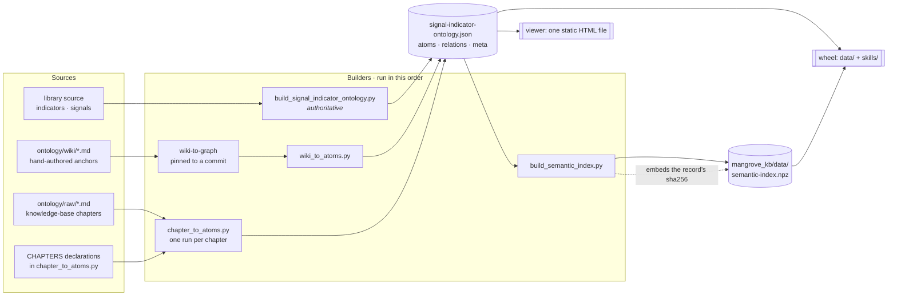
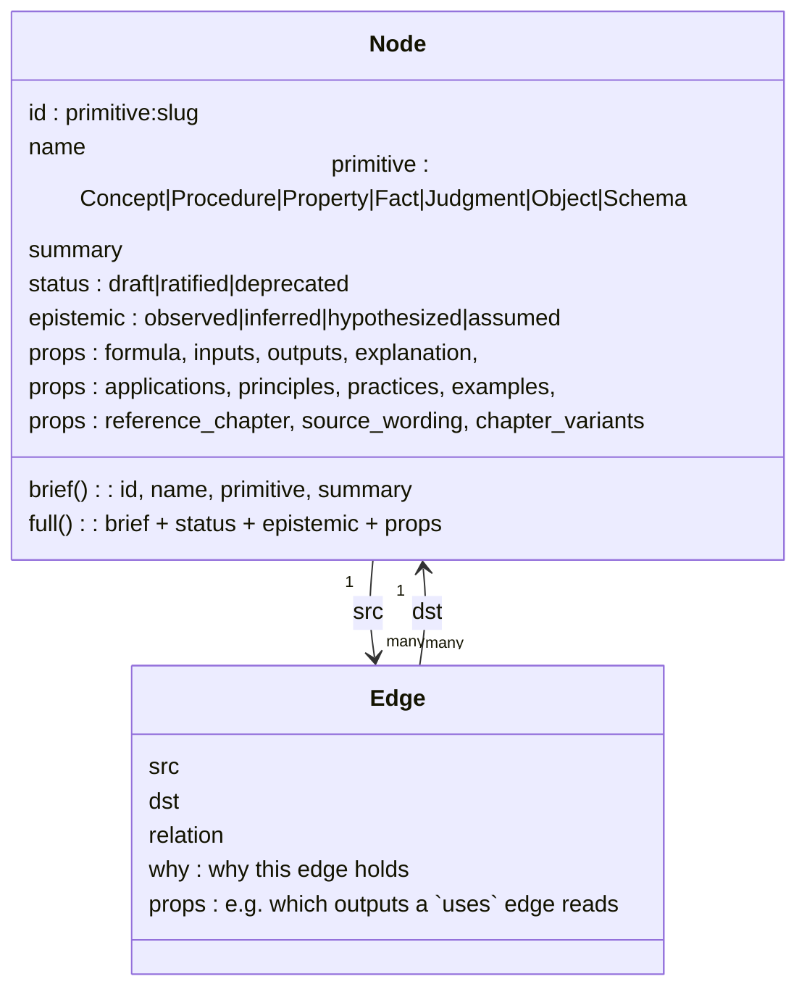
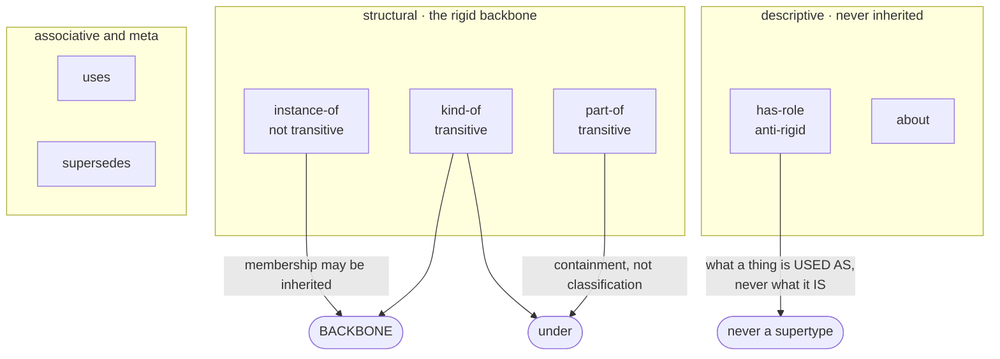
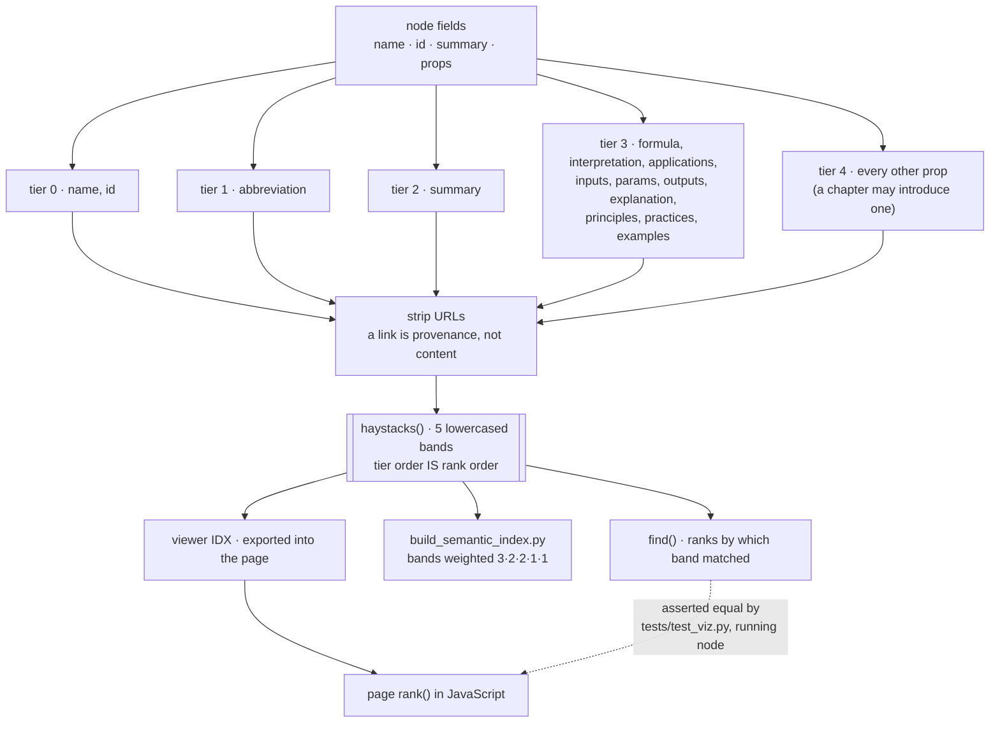
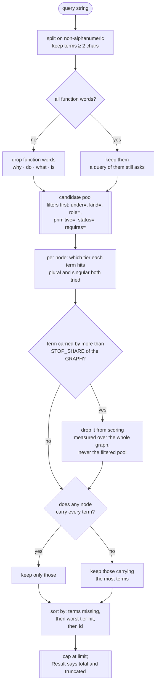
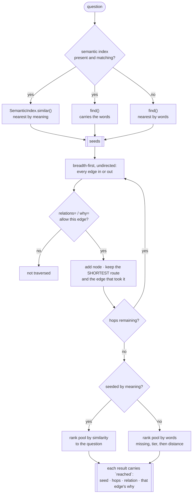
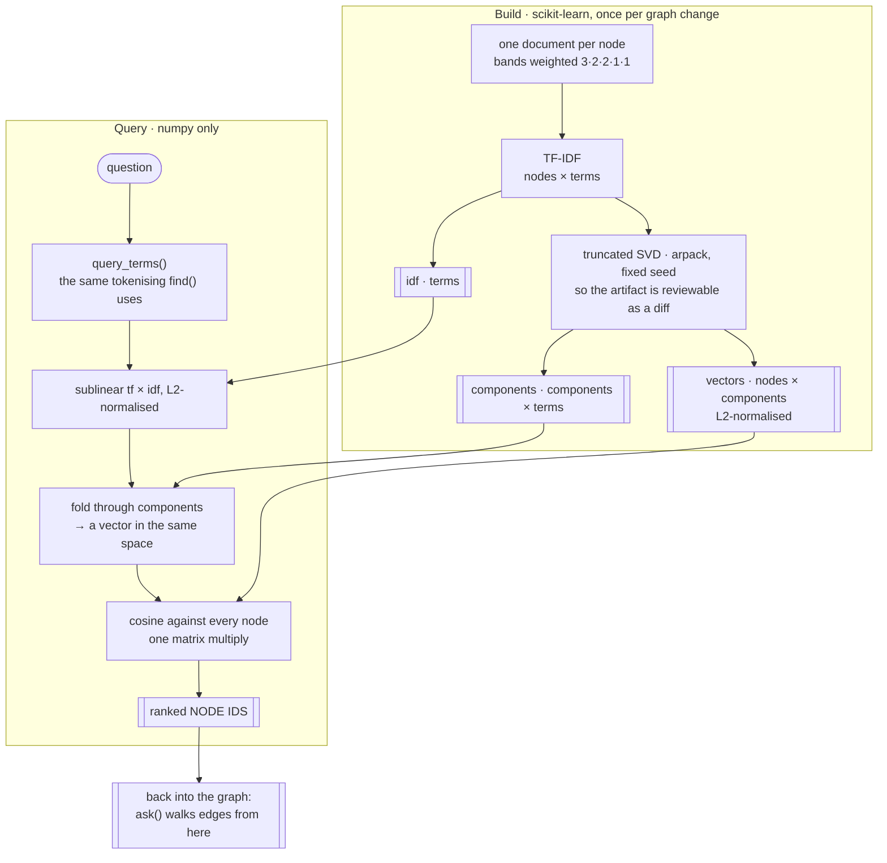
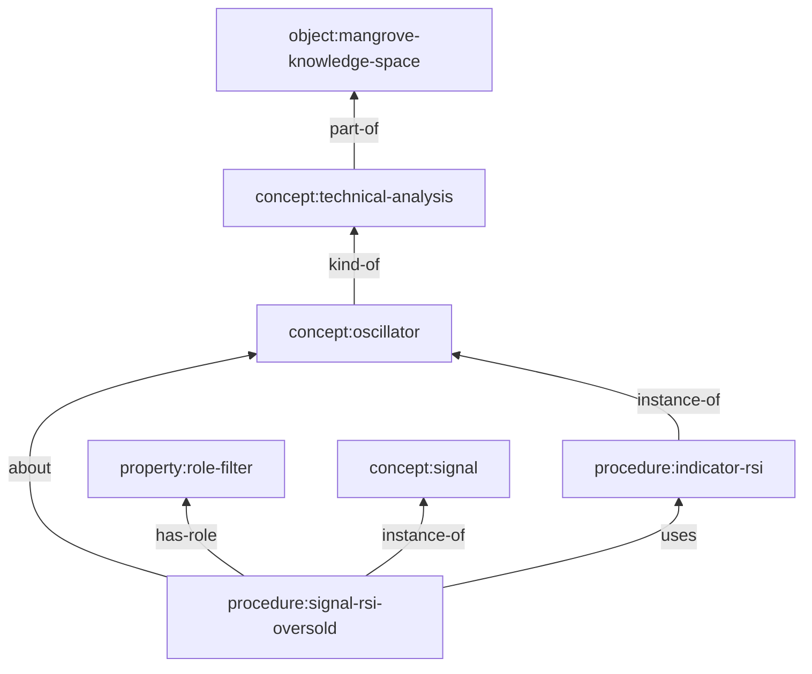

# How the knowledge graph is built, stored and searched

Seven diagrams. The first three are about **what exists and where it comes from**; the next three
about **how a question becomes an answer**; the last about **three walks that are easy to confuse**.

No counts appear in a diagram label. A number in a box goes stale silently and no test can read
prose out of a diagram — the counts that are quoted anywhere are pinned by
`tests/test_documented_counts.py` instead.

| | diagram | answers |
|---|---|---|
| 1 | [Provenance and build](#1-provenance-and-build) | Where does a node come from, and which stage may overwrite what? |
| 2 | [What a node and an edge are](#2-what-a-node-and-an-edge-are) | What is stored, and what does each relation mean? |
| 3 | [One corpus, three readers](#3-one-corpus-three-readers) | What text is searched, and who else reads it? |
| 4 | [find() — matching words](#4-find--matching-words) | Why did that query return that? |
| 5 | [ask() — answering a question](#5-ask--answering-a-question) | What is a hop, and where does selection happen? |
| 6 | [The semantic index](#6-the-semantic-index) | How is meaning represented, and why is it not a second store? |
| 7 | [Three walks](#7-three-walks-that-are-easy-to-confuse) | What do `descendants`, `in_class` and `under` each return? |

---

## 1. Provenance and build

Three independent sources feed one record. They run **in order**, each taking the previous output as
its input, and the order is not arbitrary: the code builder is authoritative and nothing downstream
may overwrite what it wrote, so it runs first and everything after it merges.

The dotted line is the guard: the index stores the checksum of the record it was built from, and a
mismatch makes it ignored rather than trusted. A chapter merged without rebuilding the index fails
`tests/test_semantic.py`.

## 2. What a node and an edge are

Everything is an atom with a primitive and a bag of authored properties; every relation carries the
reason it holds. The `why` is not decoration — it is filterable, and several traversals depend on it.

The relation vocabulary, and the property that decides how each may be walked:

`has-role` is kept out of the backbone deliberately: `filter` is a part some signals play, not a kind
of signal, and returning a role where a type is expected is the classic modelling error
(Guarino & Welty, *OntoClean*). `part-of` is structural but **not** classification — which is why
`under()` exists beside `descendants()`; see [diagram 7](#7-three-walks-that-are-easy-to-confuse).

## 3. One corpus, three readers

Every searchable string is built once, by `haystacks()`, into five bands. Three different consumers
read it, and when they disagree the search answers differently depending on where you asked.

The dotted line is the second guard: the viewer's own JavaScript is executed in a JS engine during
the test run and its ordering compared against `find()`. A Python transcription of the algorithm
would have agreed with itself while the browser disagreed.

## 4. `find()` — matching words

The path a query takes. Two rules here surprise people, and both exist because of a measured defect:
a term most of the graph carries is dropped, and a query that matches nothing in full falls back to
its best partial match rather than returning nothing.

## 5. `ask()` — answering a question

Seed, expand, re-rank. Seeding takes the nearest by meaning **and** anything carrying the question's
own words, because the two disagree often enough to lose an answer either way round. The expansion
takes **every** neighbour — there is no picking during the walk — and selection happens afterwards,
over the whole pool, because judging relevance before seeing the candidates is guessing.

Measured, right node in the top five of twenty questions: words alone 8, words + 1 hop 10,
words + 2 hops 12, meaning + 1 hop 16. More hops is not strictly better — each round adds nodes that
compete on the same score, so a correct answer can be diluted down the list.

## 6. The semantic index

Latent semantic analysis over the graph's own text. Terms that occur in the same contexts end up in
the same direction, which is how a question about a breakout that *fails* reaches a node that says it
is read as a *loss* — sharing no word with the question.

**Why this is not a disjoint layer.** Every row is keyed by a node id; there is no passage store and
no chunking, so a hit is always a node and the edges still do the explaining. It is built from the
same text `find()` searches, and it carries the record's checksum so it cannot silently answer about
an older graph. A pretrained sentence model was measured against it and scored lower on this corpus —
it knows English better and this vocabulary not at all.

## 7. Three walks that are easy to confuse

Same fragment of the graph, three questions, three different answers.

| call | walks | on `concept:oscillator` |
|---|---|---|
| `descendants()` | `instance-of` + `kind-of`, transitively — **classification only** | the indicators that measure it |
| `in_class()` | that, plus a one-hop `about` projection | those, plus the signals concerned with them |
| `under()` | every transitive structural relation **including `part-of`**, plus `instance-of` and the same `about` projection | everything contained by a subject, whatever primitive |

`descendants()` on a subject area returns nothing, because a chapter's terms are `part-of` it and not
`kind-of` it. That is exactly the bug `under()` was added to fix: "everything from market foundations"
returned almost nothing while the graph held over a hundred nodes for it.

**A role is never walked as a type.** `has-role` appears in no closure above — asking for oscillators
must never return the things merely *used as* filters.

---

## Keeping these honest

- Diagrams carry no counts; the numbers live in prose that `tests/test_documented_counts.py` pins.
- The build order in diagram 1 is enforced by `tests/test_doc_derived_atoms.py` (the record must be
  the merged output, not the code build alone) and `tests/test_rebuild_pipeline_is_runnable.py`.
- Diagram 3's dotted line is `tests/test_viz.py`, which runs the page's own JavaScript.
- Diagram 6's checksum is `tests/test_semantic.py`.
